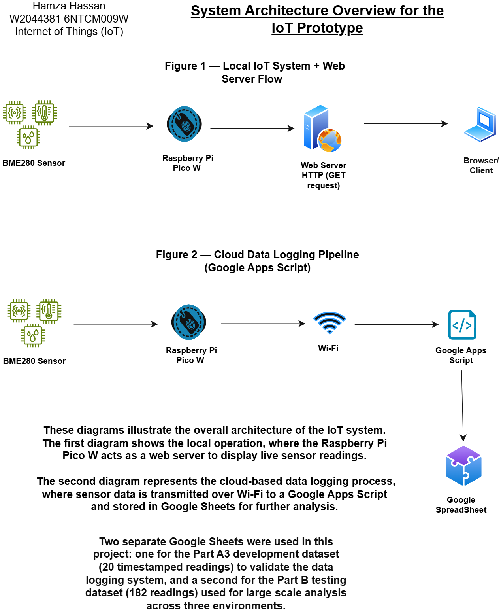
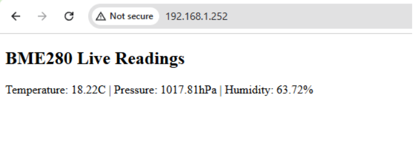
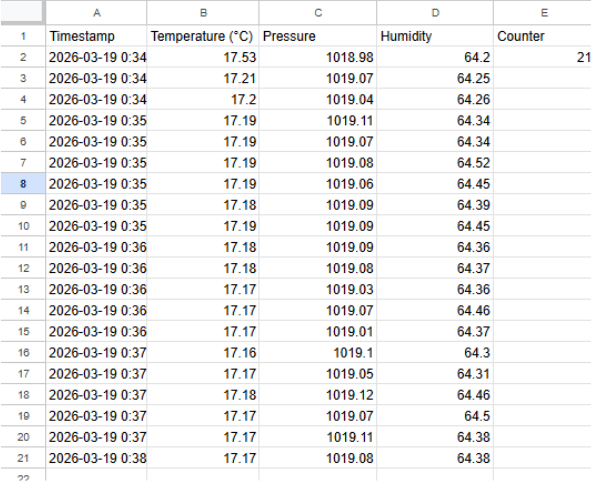
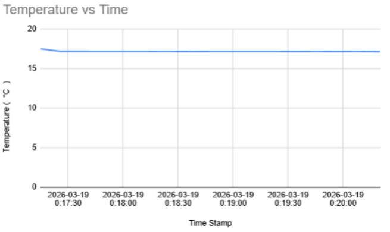
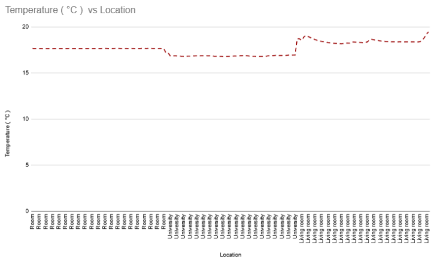

# 🌡️ IoT Environmental Monitoring System (Pico W + BME280)

A complete IoT prototype built using the Raspberry Pi Pico W and BME280 sensor, demonstrating real-time environmental monitoring, local web-based visualisation, and cloud-based data logging using Google Sheets.

---

## Overview

This project implements a full IoT data pipeline, starting from sensor data collection to cloud storage and analysis.

The system is capable of:

Reading environmental data (Temperature, Pressure, Humidity)
Hosting a local web server for live monitoring
Sending data to a cloud-based Google Sheets system
Logging timestamped readings automatically
Analysing environmental differences across multiple locations

--- 

## System Architecture:

BME280 Sensor → Pico W → Wi-Fi → Google Apps Script → Google Sheets



The system operates in two modes:

Local Mode: Pico W acts as a web server to display live sensor readings
Cloud Mode: Sensor data is sent over Wi-Fi and stored in Google Sheets

---

## Key Features

- Live sensor readings via browser with automatic 5‑second refresh
- Cloud‑based data logging using Google Apps Script
- Timestamped environmental data collection
- Data visualisation through generated graphs
- Multi‑environment testing (Room, University, Living Room)
- Robust error handling for network reliability
- Modular MicroPython scripts for clean, maintainable development

---

### 🌐 Web Server Output





The Pico W hosts a local web server that displays live BME280 readings and refreshes automatically every 5 seconds.

--- 

### ☁️ Cloud Data Logging



Sensor readings are transmitted using HTTP GET requests and stored in Google Sheets.
Each reading includes:

- Timestamp
- Temperature
- Pressure
- Humidity

---

## 📊 Data Visualisation

### Temperature vs Time (Development Dataset)



Shows stable readings during system validation (Part A).

--- 

### Temperature vs Location (Testing Dataset)



Highlights clear environmental differences:

🛏️ Bedroom → Stable (~17.6°C)
🏫 University → Cooler (~16.8–17.0°C)
🛋️ Living Room → Warmer (~18.5–19.0°C)

--- 

## Testing & Results

Total readings collected: 182

Environments tested:
- Bedroom
- University
- Living Room
  
### Key Observations

The sensor detected consistent differences between environments:
- Living room recorded the highest temperatures
- University environment showed the lowest temperatures
- Data remained stable and reliable across all tests

--- 


## Technologies Used

- Raspberry Pi Pico W
- BME280 Environmental Sensor
- MicroPython
- Thonny IDE
- Google Apps Script
- Google Sheets
- HTTP (GET requests)
- Socket Programming (Port 80)
- HTML (Dynamic webpage rendering)

--- 
### Configuration

Sensitive data has been removed:

```
ssid = ""
password = ""
SCRIPT_URL = ""
TIME_URL = ""
```

Insert your own credentials before running the project.

---

## Project Structure

scripts/ ├── bme280_sensor_test.py # Sensor validation + averaging (A1) ├── bme280_web_server.py # Local web server (A2) ├── bme280_data_logger_dev.py # A3 development logger (20 readings) ├── bme280_data_logger_test.py # Part B continuous logger (182 readings) images/ ├── architecture_diagram.png ├── web_server_output.png ├── google_sheets_data.png ├── temperature_vs_time.png ├── temperature_vs_location.png bme280.py # Sensor driver report.pdf # Coursework report README.md

--- 

## 🚀 How to Run

1️) Requirements
Raspberry Pi Pico W
BME280 sensor (I2C connection)
SDA → GP0
SCL → GP1
bme280.py uploaded to Pico

2️) Setup
Open project in Thonny
Upload required files to Pico
Enter your Wi-Fi credentials

2️⃣ Setup
Open project in Thonny
Upload required files to Pico
Enter your Wi-Fi credentials

---

### 4️⃣ Access Web Interface

After running the web server:

Pico prints: Connected on <IP>
Open browser
Visit:

```http://<printed-ip>```

---

## 📌 Conclusion

This project demonstrates how low-cost hardware and simple cloud services can be combined to build a functional IoT system.
It shows real-time monitoring, cloud integration, and data analysis across different environments, while also addressing practical aspects such as reliability and system design.

--- 

## Author Hamza Hassan - Final-Year Computer Science Student, Cloud & DevOps Enthusiast

## 📫 Connect with Me
[LinkedIn](https://www.linkedin.com/in/hamzahassan21/)
[Youtube](https://www.youtube.com/channel/UC51JEAEBV8WXwf2ZLROvUJw)
